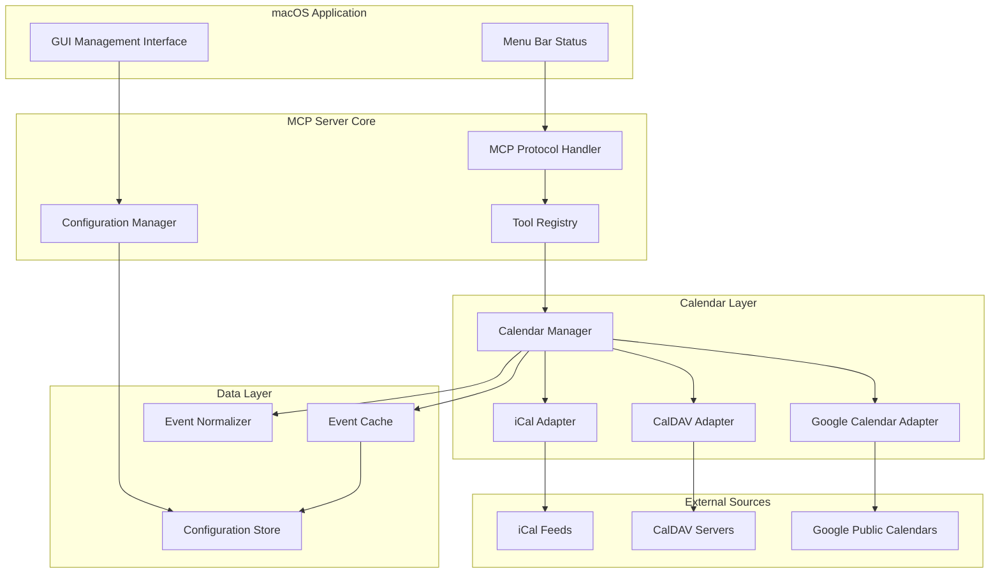

# Design Document

## Overview

The Public Calendar MCP Server is a macOS desktop application that provides AI agents with access to public calendar data through the Model Context Protocol (MCP). The system consists of two main components: an MCP server that handles AI agent requests and a native macOS GUI for managing calendar sources.

The architecture follows a modular design where the MCP server core is decoupled from both the calendar data sources and the management interface, enabling easy extensibility and maintenance.

## Architecture

### High-Level Architecture



### Component Responsibilities

- **MCP Protocol Handler**: Implements the standard MCP server interface, handles tool calls and responses
- **Tool Registry**: Manages available MCP tools (search_events, get_event_details, check_availability)
- **Calendar Manager**: Orchestrates calendar data retrieval and caching across multiple sources
- **Calendar Adapters**: Source-specific implementations for different calendar protocols
- **Event Normalizer**: Converts different calendar formats into a unified internal representation
- **Configuration Manager**: Handles dynamic configuration updates from GUI
- **GUI Management Interface**: Native macOS interface for managing calendar sources

## Components and Interfaces

### MCP Server Interface

The server implements the standard MCP protocol with the following tools:

#### search_events Tool
```json
{
  "name": "search_events",
  "description": "Search for public events by date range, location, and keywords",
  "inputSchema": {
    "type": "object",
    "properties": {
      "start_date": {"type": "string", "format": "date"},
      "end_date": {"type": "string", "format": "date"},
      "location": {"type": "string", "description": "Geographic location or venue"},
      "keywords": {"type": "array", "items": {"type": "string"}},
      "categories": {"type": "array", "items": {"type": "string"}},
      "search_logic": {"type": "string", "enum": ["AND", "OR"], "default": "AND"}
    },
    "required": ["start_date", "end_date"]
  }
}
```

#### get_event_details Tool
```json
{
  "name": "get_event_details",
  "description": "Get detailed information about a specific event",
  "inputSchema": {
    "type": "object",
    "properties": {
      "event_id": {"type": "string"},
      "include_recurrence": {"type": "boolean", "default": true}
    },
    "required": ["event_id"]
  }
}
```

#### check_availability Tool
```json
{
  "name": "check_availability",
  "description": "Check if time slots conflict with public events",
  "inputSchema": {
    "type": "object",
    "properties": {
      "time_slots": {
        "type": "array",
        "items": {
          "type": "object",
          "properties": {
            "start": {"type": "string", "format": "date-time"},
            "end": {"type": "string", "format": "date-time"}
          }
        }
      },
      "location": {"type": "string"}
    },
    "required": ["time_slots"]
  }
}
```

### Calendar Source Interface

```typescript
interface CalendarSource {
  id: string;
  name: string;
  type: 'ical' | 'caldav' | 'google';
  url: string;
  enabled: boolean;
  lastSync?: Date;
  status: 'active' | 'error' | 'syncing';
}

interface CalendarAdapter {
  fetchEvents(source: CalendarSource, dateRange: DateRange): Promise<RawEvent[]>;
  validateSource(source: CalendarSource): Promise<boolean>;
  getSourceStatus(source: CalendarSource): Promise<SourceStatus>;
}
```

### Event Data Model

```typescript
interface NormalizedEvent {
  id: string;
  sourceId: string;
  title: string;
  description?: string;
  startDate: Date;
  endDate: Date;
  location?: {
    name: string;
    address?: string;
    coordinates?: {lat: number, lng: number};
  };
  organizer?: {
    name: string;
    email?: string;
  };
  categories: string[];
  recurrence?: RecurrenceRule;
  url?: string;
  lastModified: Date;
}
```

### GUI Interface Components

The macOS GUI will be built using SwiftUI and include:

1. **Main Window**: List of calendar sources with status indicators
2. **Add Calendar Sheet**: Form for adding new calendar sources
3. **Settings Panel**: Server configuration and startup options
4. **Menu Bar Item**: Server status and quick access to GUI

## Data Models

### Configuration Storage

Configuration is stored in JSON format in the user's Application Support directory:
`~/Library/Application Support/PublicCalendarMCP/config.json`

```json
{
  "server": {
    "port": 3000,
    "autoStart": true,
    "cacheTimeout": 3600
  },
  "sources": [
    {
      "id": "uuid-1",
      "name": "City Events",
      "type": "ical",
      "url": "https://example.com/events.ics",
      "enabled": true,
      "refreshInterval": 1800
    }
  ]
}
```

### Event Caching Strategy

- **In-Memory Cache**: Recent events (last 7 days, next 30 days) kept in memory
- **Persistent Cache**: SQLite database for longer-term storage
- **Cache Invalidation**: Time-based (configurable) and source-triggered updates
- **Partial Updates**: Only fetch changed events when supported by source

## Error Handling

### MCP Error Responses

All MCP tools return standardized error responses:

```json
{
  "error": {
    "code": "CALENDAR_SOURCE_UNAVAILABLE",
    "message": "One or more calendar sources are currently unavailable",
    "details": {
      "unavailable_sources": ["source-id-1"],
      "partial_results": true
    }
  }
}
```

### GUI Error Handling

- **Connection Errors**: Visual indicators in source list, retry mechanisms
- **Configuration Errors**: Inline validation with helpful error messages
- **Server Errors**: Menu bar status updates, notification center alerts

### Graceful Degradation

- Continue serving available sources when others fail
- Return partial results with clear indication of missing sources
- Implement exponential backoff for failed source connections
- Cache last successful results as fallback

## Testing Strategy

### Unit Testing

- **Calendar Adapters**: Mock external calendar sources, test data parsing
- **Event Normalizer**: Test conversion between different calendar formats
- **MCP Tools**: Test tool parameter validation and response formatting
- **Configuration Manager**: Test dynamic config updates and validation

### Integration Testing

- **End-to-End MCP Flow**: Test complete request/response cycle
- **Multi-Source Scenarios**: Test behavior with multiple calendar sources
- **Error Scenarios**: Test graceful handling of source failures
- **GUI Integration**: Test configuration changes propagating to server

### Manual Testing

- **macOS Integration**: Test native look and feel, menu bar behavior
- **Real Calendar Sources**: Test with actual public calendar feeds
- **Performance Testing**: Test with large numbers of events and sources
- **User Experience**: Test GUI workflows for adding/removing calendars

### Test Data

Create mock calendar data covering:
- Different event types (single, recurring, all-day)
- Various calendar formats (iCal, CalDAV responses)
- Edge cases (timezone handling, malformed data)
- Large datasets for performance testing

The testing approach ensures reliability across all components while maintaining the user experience standards expected on macOS.